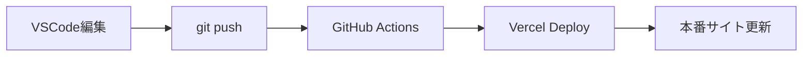

# Doctor Direct プロジェクト

このプロジェクトは、Next.js製のフロントエンドアプリケーションとTailwind CSSで構成されたモダンな医療相談プラットフォームです。

## 技術スタック

### フロントエンド
- Next.js 15.x (App Router)
- TypeScript
- Tailwind CSS
- React 19.x

### 認証・セキュリティ
- NextAuth.js (OAuth認証)
- Google OAuth 2.0
- GitHub OAuth
- JWT セッション管理

### インフラ・デプロイ
- Vercel (ホスティング)
- GitHub Actions (CI/CD)

## セットアップ

プロジェクトのセットアップ手順：

```bash
# 依存関係のインストール
npm install

# 環境変数設定
cp .env.local.example .env.local
# .env.local を編集して必要な値を設定

# 開発サーバーの起動
npm run dev
```

## 起動方法

### 🚀 開発環境

```bash
npm run dev
```

開発サーバーは `http://localhost:3000` で利用可能になります。

### 📦 その他のコマンド

```bash
# Next.jsのビルド
npm run build

# 本番環境での起動
npm start

# ESLintチェック
npm run lint
```

## 🔐 認証機能

このプロジェクトには **NextAuth.js** による認証機能が統合されています：

### サポート認証方式
- **Google OAuth** - Googleアカウントでログイン
- **GitHub OAuth** - GitHubアカウントでログイン
- **JWT セッション** - サーバーレス環境に最適化

### 認証の設定

#### 環境変数 (.env.local)
```bash
# NextAuth.js 必須設定
NEXTAUTH_SECRET=your-secret-key-here
NEXTAUTH_URL=http://localhost:3000

# Google OAuth (オプション)
GOOGLE_CLIENT_ID=your-google-client-id
GOOGLE_CLIENT_SECRET=your-google-client-secret

# GitHub OAuth (オプション)  
GITHUB_ID=your-github-client-id
GITHUB_SECRET=your-github-client-secret
```

#### OAuth アプリの設定
認証を有効にするには、各プロバイダーでOAuthアプリを作成する必要があります：

**Google OAuth:**
1. [Google Cloud Console](https://console.cloud.google.com)
2. APIs & Services → Credentials → Create OAuth 2.0 Client ID
3. Authorized redirect URIs: `http://localhost:3000/api/auth/callback/google`

**GitHub OAuth:**
1. GitHub → Settings → Developer settings → OAuth Apps
2. New OAuth App
3. Authorization callback URL: `http://localhost:3000/api/auth/callback/github`

## 🚀 自動デプロイ設定

このプロジェクトは **VSCode → GitHub → Vercel** の完全自動デプロイパイプラインを構築済みです。

### 前提条件
- ✅ GitHub リポジトリ作成済み
- ✅ Vercel アカウント作成済み
- ✅ GitHub Actions ワークフロー設定済み (`.github/workflows/deploy.yml`)

### STEP 1: Vercel API設定

#### 1-1. Vercel API Token取得
1. [Vercel Dashboard](https://vercel.com/account/tokens) にアクセス
2. **「Create Token」** をクリック
3. **Token Name**: `GitHub Actions Deploy`
4. **Scope**: `Full Account`
5. **「Create」** → **トークンをコピー** 📋

#### 1-2. Vercel Project ID取得
1. **Vercel Dashboard** → 対象プロジェクト選択
2. **Settings** → **General**
3. **Project ID** をコピー 📋

#### 1-3. Vercel Org ID取得
1. **Vercel Dashboard** → **Settings** → **General**
2. **Team ID** をコピー 📋

### STEP 2: GitHub Secrets設定

1. **GitHub リポジトリ** → **Settings** タブ
2. **Secrets and variables** → **Actions**
3. **「New repository secret」** で以下を追加：

```
# Vercel デプロイ用
VERCEL_TOKEN = [STEP 1-1で取得したトークン]
VERCEL_PROJECT_ID = [STEP 1-2で取得したProject ID]
VERCEL_ORG_ID = [STEP 1-3で取得したOrg ID]

# NextAuth.js 認証用
NEXTAUTH_SECRET = [生成したシークレットキー]
NEXTAUTH_URL = https://your-domain.vercel.app

# OAuth設定 (オプション)
GOOGLE_CLIENT_ID = [Google OAuth Client ID]
GOOGLE_CLIENT_SECRET = [Google OAuth Client Secret]
GITHUB_ID = [GitHub OAuth App ID]
GITHUB_SECRET = [GitHub OAuth App Secret]
```

### STEP 3: デプロイフロー



#### 日常の開発フロー
```bash
# 1. ローカル開発
npm run dev

# 2. 変更をコミット
git add .
git commit -m "feat: 新機能追加"

# 3. プッシュ（自動デプロイ開始）
git push origin main
```

#### Pull Request フロー
```bash
# 1. フィーチャーブランチ作成
git checkout -b feature/new-feature

# 2. 開発・コミット
git add .
git commit -m "feat: 新機能実装"

# 3. プッシュ
git push origin feature/new-feature

# 4. GitHub でPR作成
# → プレビューデプロイが自動実行される
# → PRにプレビューURLが自動コメントされる

# 5. レビュー完了後、mainにマージ
# → 本番デプロイが自動実行される
```

## デプロイ確認方法

### GitHub Actions確認
1. **GitHub Repository** → **Actions** タブ
2. ワークフロー実行状況を確認
3. エラーがある場合はログを確認

### Vercel確認
1. **Vercel Dashboard** → **Deployments**
2. デプロイ状況を確認
3. 本番URLで動作確認

### 認証機能確認
1. 本番サイトでヘッダーの「ログイン」ボタンをクリック
2. OAuth認証画面が表示されることを確認
3. 認証後、ユーザー情報がヘッダーに表示されることを確認

## トラブルシューティング

### ❌ ビルドエラーが発生した場合
```bash
# ローカルでビルドテスト
npm run build

# エラーを修正してプッシュ
git add .
git commit -m "fix: ビルドエラー修正"
git push origin main
```

### ❌ 認証エラーが発生した場合
1. **環境変数確認**: Vercel環境変数が正しく設定されているか
2. **OAuth設定確認**: リダイレクトURLが本番URLに設定されているか
3. **NEXTAUTH_SECRET確認**: 本番環境で設定されているか

### ❌ GitHub Actions失敗
1. **Actions** タブでログを確認
2. **Secrets** が正しく設定されているか確認
3. 必要に応じてVercel Tokenを再生成

## プロジェクト構成

```
├── .github/
│   └── workflows/
│       └── deploy.yml     # 自動デプロイ設定
├── .env.local             # ローカル環境変数
├── app/                   # Next.js App Router
│   ├── globals.css        # Tailwind CSS設定
│   ├── layout.tsx         # ルートレイアウト（認証Provider含む）
│   ├── page.tsx           # メインページ
│   └── api/
│       └── auth/
│           └── [...nextauth]/
│               └── route.ts # NextAuth.js API
├── components/            # Reactコンポーネント
│   ├── AuthButton.tsx     # 認証ボタン
│   ├── AuthProvider.tsx   # 認証プロバイダー
│   ├── Header.tsx         # ヘッダー（認証統合済み）
│   ├── Hero.tsx           # ヒーローセクション
│   ├── Features.tsx       # 機能セクション
│   ├── CTA.tsx            # CTAセクション
│   └── Footer.tsx         # フッターコンポーネント
├── types/
│   └── next-auth.d.ts     # NextAuth.js型定義
├── public/                # 静的ファイル
├── next.config.js         # Next.js設定（Vercel最適化済み）
├── vercel.json            # Vercel設定ファイル
├── tailwind.config.js     # Tailwind CSS設定
└── tsconfig.json          # TypeScript設定
```

## 主な機能

- **レスポンシブデザイン**: 全デバイス対応
- **AI症状診断**: 症状入力による分析機能
- **医師検索**: 専門医師の検索・予約
- **病院検索**: 近隣病院の検索機能
- **オンライン相談**: リアルタイム医療相談
- **ユーザー認証**: Google/GitHub OAuth対応
- **セキュリティ**: 医療情報の暗号化保護

## 今後の拡張予定

- バックエンドAPI統合
- データベース連携（Prisma）
- リアルタイム通信（Socket.io）
- ユーザープロファイル管理
- 医師認証システム